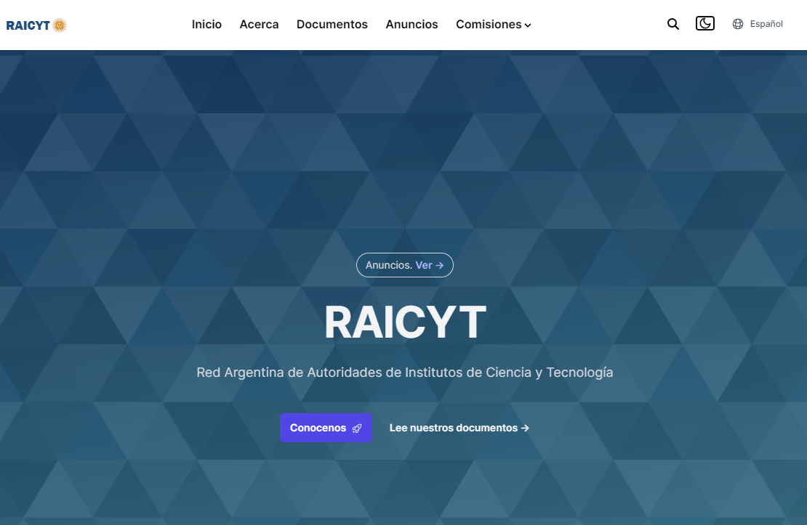

# Sitio Web RAICYT

El sitio está creado con Hugo Blox usando el template **Landing Page Template**.

  

Las paginas se pueden editar directamente en Github [usando el editor nativo](https://docs.github.com/en/repositories/working-with-files/managing-files/editing-files). El contenido tiene marcado muy mínimo con [Markdown](https://docs.hugoblox.com/reference/markdown/).  

Para contribuir con contenido (texto, fotos), correcciones, traducciones, contactar a la comisión Web RAICYT (o github issues). 

--
RAICyT
