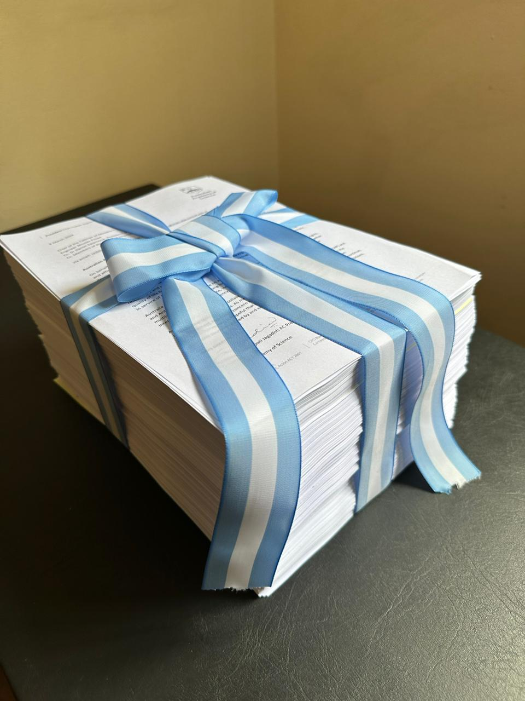

Desde su creación, RAICYT ha recibido el apoyo de numerosos colegas e instituciones de todas partes del mundo, adhiriendo a nuestra preocupación sobre la situación actual del sistema científico y tecnológico argentino. **El número de cartas de apoyo recibidas hasta el momento superan las 1000**.

En la [6ta reunión de RAICYT](Resumen6TAreunion.pdf) se decidió hacer entrega de una copia de las más de 1000 cartas de apoyo de nuestros colegas del exterior a la Jefatura de Gabinete de Ministros y al CONICET. 

Hoy miércoles 10 de abril, día en el que se conmemora al investigador/a científico/a, se realizó la entrega de estas cartas en la Jefatura de Gabinete de Ministros. Para ver la nota entregada en el día de hoy al Jefe del Gabinete de Ministros 
[hacé click acá.](/es/documentos/carta-entrega-adhesiones-jefatura-gabinete/caratula-cartas-adhesion-JGM.pdf)

El próximo miércoles 17 de abril se hará entrega de otra copia de las adhesiones a las autoridades de CONICET, esta vez con un acto especial en que se leerán fragmentos de las cartas recibidas y se hará un abrazo al CONICET y al ex-MinCYT, junto con otras sorpresas. 

**Convocamos a toda la comunidad a que se sumen y participen de esta entrega el miércoles 17 de abril a las 16 h en el Polo Científico Tecnológico (Godoy Cruz 2320, CABA) para defender el desarrollo científico tecnológico nacional.**

