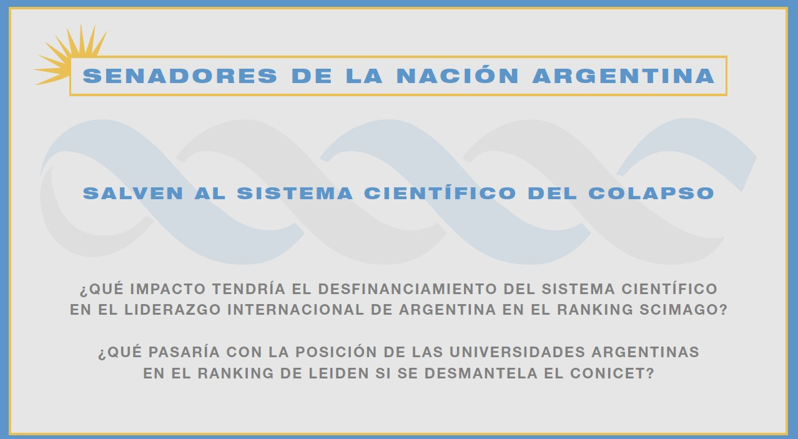

¿QUÉ IMPACTO TENDRÍA EL DESFINANCIAMIENTO DEL SISTEMA CIENTÍFICO EN EL LIDERAZGO INTERNACIONAL DE ARGENTINA EN EL RANKING SCIMAGO?
¿QUÉ PASARÍA CON LA POSICIÓN DE LAS UNIVERSIDADES ARGENTINAS EN EL RANKING DE LEIDEN SI SE DESMANTELA EL CONICET?

 [El posible colapso del sistema científico explicado acá](INFOGRAFIA.pdf)

